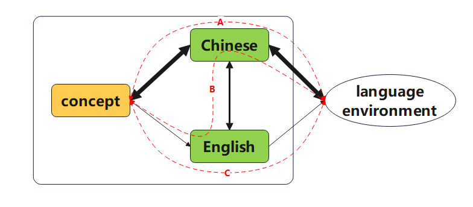

# lincore
&ensp;&ensp;&ensp;&ensp;建立一个高效语言学习框架
# 1.Introduction
&ensp;&ensp;&ensp;&ensp;语言生成过程的认知机制一直是心理语言学研究的核心问题之一。Levelt（1989）提出的言语产生模型（Speaking Model）通过lemma检索、语法编码等多阶段理论，系统解释了从概念到语音的转换过程。后续研究表明（Indefrey & Levelt, 2004），这一过程涉及前额叶、布洛卡区等多个脑区的协同工作，印证了其复杂性。为聚焦第二语言习得（SLA）的应用场景，本项目采用简化视角，仅关注"概念-语言接口"（conceptual-linguistic interface）这一关键环节。 
&ensp;&ensp;&ensp;&ensp;在语言使用频率分布方面，实证研究支持"核心词汇"的高效性：① Nation（2006）发现2000个高频词可覆盖80%的日常交流；② Zipf定律（Piantadosi, 2014）定量揭示了词汇分布的极端偏态特性。基于此，本项目将语言元素区分为："核心基集"（高频、通用型表达式）与"扩展集"（低频、领域特异性表达式）——这与Ellis（2016）提出的"基于使用的语言学习理论"（Usage-Based Theory）中"构式频率效应"形成呼应。 
&ensp;&ensp;&ensp;&ensp;由此引申出核心假设：能否通过母语与二语的"核心基集"映射（cross-linguistic priming, Kroll & Stewart, 1994），结合针对性接口训练，建立跨语言的直接概念联结（conceptual mediation），从而规避传统语法翻译法的效率瓶颈（Cook, 2016）？这一猜想得到双语表征研究的部分支持（Dijkstra & Van Heuven, 2002），但具体训练路径仍需实证检验。 
&ensp;&ensp;&ensp;&ensp;值得注意的是，个体语言表征存在显著差异（Beckner et al., 2017）。例如，回应确认场景中，个体可能优先选择"明白了"而非"知道了"等变体——这种"个人化基集"（idiosyncratic core set）的差异，导致普适性教学法常面临迁移效率损耗（transfer efficiency loss, Jarvis & Pavlenko, 2008）。近期计算语言学研究表明（Tyler et al., 2020），通过自然语言处理（NLP）技术可有效识别个体的高频表达式聚类模式，这为"个性化基集映射"（personalized core set alignment）提供了技术可行性。 
&ensp;&ensp;&ensp;&ensp;基于此，本研究将扩展初始假设：通过①学习者母语使用数据的认知模式分析（参考Ellis et al., 2016的语料驱动学习框架）；②跨语言核心基集的动态对齐（dynamic alignment, 借鉴Kootstra & Muysken, 2022的互动适应模型）；③神经可塑性导向的接口训练（参考Deng & Lin, 2021的联结强度优化方案），构建自适应二语习得框架。该框架的技术实现将整合心理语言学理论与机器学习方法，其有效性可通过"概念-词汇响应时差"（conceptual-lexical latency, 参照Finkbeiner et al., 2017的跨模态实验范式）进行量化评估。 

# 2.Methodology
方案一：
1. 分析：
    - 语料收集（不含上下文）
    - 语料分析生成母语核心基集
2. 生成：
    - 母语核心基集转换二语核心基集
    - 通过二语核心基集构建上下文
    - 上下文生成为习题

方案二：
- 语料收集（含上下文）
- 分析提取核心基集和相关上下文
- 转换
- 生成习题
 
#TODO
SLA

